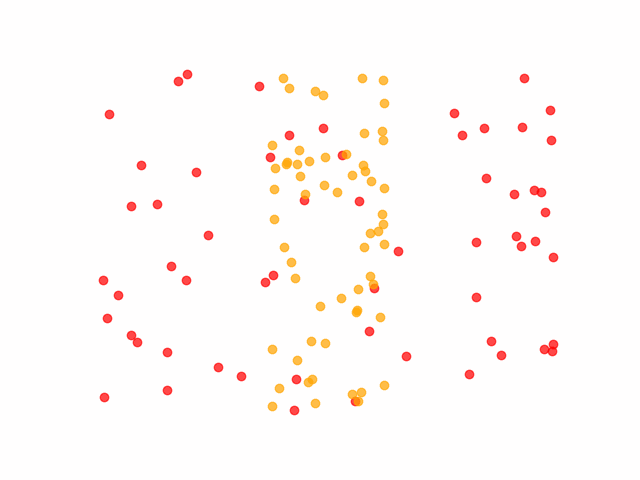

# monocular-motion-parallax

Симуляция механизма монокулярного динамического параллакса движения и феномена слития мельканий 
(или «стробоскопический эффект»; пример случайно-точечных цилиндров).

Конфигурация анимации: `config.yml`

Сгенерировать анимацию:

```commandline
cd core
python main.py
```

