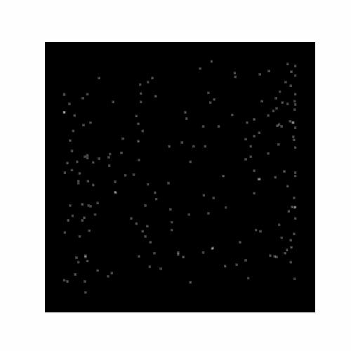

# monocular-motion-parallax

Симуляция механизма монокулярного динамического параллакса движения и феномена слития мельканий 
(или «стробоскопический эффект»; пример случайно-точечных цилиндров).

Конфигурация анимации: `config.yml`

Сгенерировать анимацию:

```commandline
cd core
python main.py
```



### Литература:

- Ульман Ш. Принципы восприятия подвижных объектов. 1983 г 

- Шиффман Х.Р. Ощущение и восприятие. 2003 г

- [Объяснение параллакса движения](https://studme.org/182261/psihologiya/monokulyarnyy_parallaks_dvizheniya)
